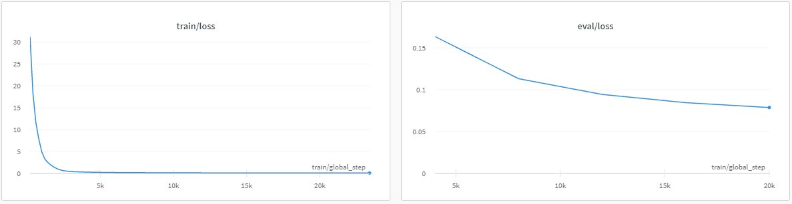
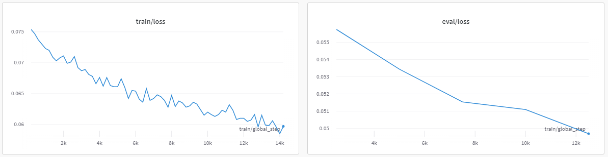

# mT5模型标点符号预测
### 项目说明
本项目旨在训练一个mT5模型，用于为无标点句子标标点，用于语音识别模型的后处理。

### 文件说明

train_v2.py 用于训练

predict.py 用于测试预测效果

dataset_processing.py 用于预处理数据集

support.py 支持函数

count.py 用于统计数据集中每个句子平均有多少个token，根据统计数据更科学地构建训练数据

train_on_wiki.py 旧训练代码

### 训练须知
以下是我在测试时候使用的配置
- 默认训练配置为small模型，batchsize=6，每16步更新一次参数，所以总批量大小是96。
- 使用Wikipedia中文数据集中的50万个样本和亚马逊评论数据集的训练集混合。
- 这个配置下占用23GB显存，在3090上约18个小时跑完1个epoch。
- 我一开始纯在Wikipedia数据集上训练，发现效果不理想，然后又动手构造了一个包含Wikipedia和Amazon评论的新数据集，在上面微调。（为什么不重新训练而是微调呢？因为没钱）
- 训练Loss

在Wikipedia上预训练

在Wikipedia+Amazon评论数据集上微调

### 以下记录下要注意的地方

报错：
TypeError: Descriptors cannot not be created directly.
If this call came from a _pb2.py file, your generated code is out of date and must be regenerated with protoc >= 3.19.0.
If you cannot immediately regenerate your protos, some other possible workarounds are:
 1. Downgrade the protobuf package to 3.20.x or lower.
 2. Set PROTOCOL_BUFFERS_PYTHON_IMPLEMENTATION=python (but this will use pure-Python parsing and will be much slower).

解决方案：
pip install grpcio-status==1.33.2 protobuf==3.19.6

报错：
ValueError: Couldn't instantiate the backend tokenizer while loading model tokenizer

解决方案：
pip install sentencepiece