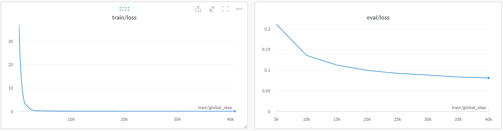
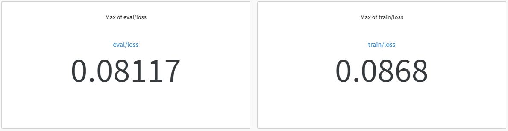

# mT5模型标点符号预测
### 项目说明
本项目旨在训练一个mT5模型，为无标点句子标标点，用于语音识别模型的后处理。

### 使用说明

train_v2.py 用于训练

predict_v2.py 用于测试预测效果

dataset_processing_v2.py 用于数据预处理

support.py 支持函数

count.py 用于统计数据集中每个句子平均有多少个token，根据统计数据更科学地构建训练数据

peft_finetune.py 使用LoRA进行训练

### 训练笔记
以下是我在测试时候使用的配置
- 默认训练配置为small模型，batchsize=6，每16步更新一次参数，所以总批量大小是96。请根据你的显存大小选择合适的batchsize和梯度累加步数。
- 使用Wikipedia中文数据集和亚马逊评论数据集的训练集混合。
- 训练时候我没有像正常的T5训练那样在输入前面加个prompt，加没加效果有多大区别不知道，应该做个消融实验。
- 这个配置下占用23GB显存，在3090上约2天跑完1个epoch。
- 使用LoRA训练大约加速20%，显存省一半，收敛速度变慢，最终Loss差多少没做过实验。如果你的显存吃紧就用LoRA吧！

- 训练Loss如下（不使用LoRA）

训练Loss曲线

训练Loss

### TODO

- 写使用peft预测的代码

### 以下记录下要注意的地方

- 报错：
TypeError: Descriptors cannot not be created directly.
If this call came from a _pb2.py file, your generated code is out of date and must be regenerated with protoc >= 3.19.0.
If you cannot immediately regenerate your protos, some other possible workarounds are:
 1. Downgrade the protobuf package to 3.20.x or lower.
 2. Set PROTOCOL_BUFFERS_PYTHON_IMPLEMENTATION=python (but this will use pure-Python parsing and will be much slower).

解决方案：
pip install grpcio-status==1.33.2 protobuf==3.19.6

- 报错：
ValueError: Couldn't instantiate the backend tokenizer while loading model tokenizer

解决方案：
pip install sentencepiece